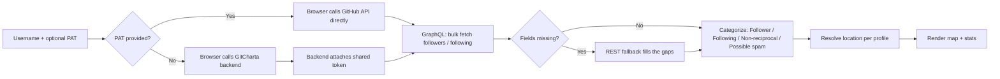

<div align="center">

# 🗺️ GitCharta

**Every star, fork, and follow is a country you've reached. GitCharta turns your GitHub footprint into an interactive world map of exactly how far your work travels.**

[](https://gitcharta.vercel.app/)
[](#license)
[](#tech-stack--prerequisites)

**[Try the live demo →](https://gitcharta.vercel.app/)**: no GitHub token required to start.

</div>

<p align="center">
  
</p>

---

Followers, stars, forks, pull requests: GitHub gives you raw counts. GitCharta is an open-source GitHub network visualizer that turns your whole footprint into a map, so you see exactly how far your work travels. Somewhere on it might be the first person from their country to reach you. Today GitCharta maps followers and following, sorted into followers, following, non-reciprocal connections, and likely spam accounts; star, fork, and PR maps are next.

## Getting Started

GitCharta runs entirely at [gitcharta.vercel.app](https://gitcharta.vercel.app/): there's nothing to install. Open the live app and:

- Enter the GitHub username you want to map.
- _(Optional)_ Paste your own PAT to skip the shared demo rate limit.
- Click **Generate Map** to explore followers, following, non-reciprocal connections, and possible spam accounts on the interactive map.

Want to contribute or run GitCharta locally? See [Contributing](#contributing).

## Key Features

- **Interactive world map**: every account plotted by country, so you see where you've actually reached.
- **Followers**: geographic distribution of the people who follow your work.
- **Following**: where the people and projects you learn from are based.
- **Non-reciprocal**: accounts you follow that don't follow back: real connections, one-way.
- **Possible spam**: public-profile heuristics (empty bio, no avatar, zero repos, lopsided follow ratios) flag likely bots or inactive accounts so they don't inflate your reach.
- **Unlocated**: a dedicated view for accounts without a usable public location, so nobody just vanishes from the picture.
- **Statistics**: at-a-glance numbers: countries reached, category breakdown, top countries, and more.
- **Privacy-first token handling**: bring your own GitHub token and it's used directly in your browser, never sent to GitCharta's backend. Skip it and use a shared, rate-limited demo token instead.

## Tech Stack / Prerequisites

**Tech stack**

- Frontend: React, Vite, TypeScript
- Mapping/visualization: D3 with custom geocoding
- Data source: [GitHub GraphQL API](https://docs.github.com/en/graphql) (primary), [GitHub REST API](https://docs.github.com/en/rest) (fallback)
- Hosting: Vercel (static frontend plus a serverless function for the demo-token proxy)

**Prerequisites**

- Nothing, to use the live app.
- Node.js and npm, only if you're contributing or running GitCharta locally: see [Contributing](#contributing).
- Optional: a GitHub Personal Access Token (PAT) with `read:user` scope, for higher rate limits on the live app.

## Contributing

Contributions are welcome.

1. Fork the repository.
2. Create a branch for your change:
   ```bash
   git checkout -b feature/your-feature-name
   ```
3. Install dependencies and start the dev server:
   ```bash
   npm install
   npm run dev
   ```
4. Commit your changes with a clear message:
   ```bash
   git commit -m "feat: add heatmap rendering mode"
   ```
5. Push to your fork and open a pull request describing what you changed and why.

Running locally puts you in bring-your-own-token mode by default, since no shared token is configured. To also test the demo/shared-token flow locally, set the environment variable below.

| Variable            | Required                                       | Description                                                                                                           |
| ------------------- | ---------------------------------------------- | --------------------------------------------------------------------------------------------------------------------- |
| `DEMO_GITHUB_TOKEN` | Only to run the shared demo-token flow locally | Server-side token used to serve requests from visitors without their own PAT. Never bundled or exposed to the client. |

Add `.env` to `.gitignore` and never commit real tokens.

Good first issues: check the [Issues tab](../../issues) for anything labeled `good first issue`.

## How It Works



1. **Input**: you provide a GitHub username to map, and optionally your own PAT.
2. **Route**: with a PAT, your browser talks to GitHub directly. Without one, the request goes through GitCharta's backend, which attaches a shared, rate-limited token; your own credentials are never part of this path.
3. **Fetch**: the GitHub GraphQL API is queried first, since it pulls followers, following, and profile fields in far fewer round trips than REST. Anything GraphQL leaves out is recovered with targeted REST calls.
4. **Categorize**: accounts are cross-referenced and heuristically screened into followers, following, non-reciprocal, and possible spam.
5. **Resolve**: each account's public location field is used to place it on the map; accounts without one land in the dedicated unlocated view.
6. **Render**: results are plotted on an interactive world map, alongside the statistics panel.

## 🗺️ Roadmap

Planned for upcoming releases:

| Status | Feature                   | Description                                                              | Notes                            |
| ------ | ------------------------- | ------------------------------------------------------------------------ | -------------------------------- |
| ⬜     | **Stargazer maps**        | Map the people starring your repos : reach beyond your social graph      |                                  |
| ⬜     | **Fork maps**             | See where the people forking your projects are based                     |                                  |
| ⬜     | **Contributor / PR maps** | Plot everyone who's opened a PR against your repos or org                |                                  |
| ⬜     | **Map screenshots**       | Export your map as an image to share or drop into a README               |                                  |
| ⬜     | **Zoom & pan**            | Get in close on any region instead of squinting at the whole world       |                                  |
| ⬜     | **GitHub profile badge**  | Embed a live badge of your map straight into your GitHub profile README  |                                  |
| ⬜     | **Coverage badge**        | A badge showing what percentage of the world your reach covers           |                                  |
| ⬜     | **Direct Unfollow**       | Unfollow non-reciprocal or spam accounts straight from the map interface | Requires `user:follow` PAT scope |
| ⬜     | **Advanced Color Modes**  | Heatmap, radar view, and a "Contribution Green" theme                    |                                  |
| ⬜     | **UI/UX Overhaul**        | Ongoing improvements to interface and user flow                          |                                  |

Have an idea? [Open an issue](../../issues) to suggest a feature.

## License

Distributed under the MIT License. See `LICENSE` for details.

## Get in Touch

GitCharta is built and maintained by Thierry Rakotomanana. If it's useful to you, or you just want to talk shop, don't be a stranger:

- Open an [issue](../../issues) or [pull request](#contributing): the fastest way to reach me about the project itself.
- Follow or connect on [GitHub @ThierryRakotomanana](https://github.com/ThierryRakotomanana).
- Say hi on [Twitter/X @ThieryRakt](https://twitter.com/ThieryRakt).

[](https://github.com/ThierryRakotomanana)
[](https://twitter.com/ThieryRakt)
