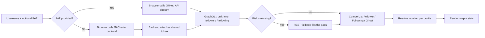

<div align="center">

# 🗺️ GitCharta

**See exactly who's in your GitHub network : and where they're building from.**

An interactive world map that visualizes the geographic distribution of your followers, the people you follow, and the "ghosts" who don't follow you back.

[](https://github-audience-atlas.vercel.app/)
[](#-roadmap)
[](#-roadmap)
[](#-prerequisites)
[](#-contributing)
[](#-license)

**🔗 [Try it live](https://github-audience-atlas.vercel.app/) : no token required to start, bring your own PAT any time to skip the shared demo limit.**

[Live Demo](https://github-audience-atlas.vercel.app/) • [Features](#-key-features) • [Security](#-security--privacy) • [Quick Start](#-quick-start) • [Usage](#-usage) • [Architecture](#-how-it-works) • [Contributing](#-contributing)

</div>

<br>

<p align="center">
  
</p>

---

## 📖 Table of Contents

- [Overview](#-overview)
- [Security & Privacy](#-security--privacy)
- [Key Features](#-key-features)
- [Tech Stack](#-tech-stack)
- [Prerequisites](#-prerequisites)
- [Quick Start](#-quick-start)
- [Usage](#-usage)
- [How It Works](#-how-it-works)
- [Roadmap](#-roadmap)
- [Contributing](#-contributing)
- [License](#-license)
- [Author & Contact](#-author--contact)

---

## 🎯 Overview

### The Problem

GitHub gives you raw lists of followers and following : but no sense of who these people actually are or where your influence really reaches. It's also easy to lose track of **non-reciprocal relationships**: accounts you follow that never followed back.

### The Solution

**GitCharta** turns your network data into a single, explorable world map. Point it at any GitHub account and it plots:

- 🌍 Where your **audience** is physically located
- 🌍 Where the people **you learn from** are based
- 👻 Which of them are **ghosts** : one-way follows with no reciprocity (don't follow you back)

You don't need anything to try it : a shared, rate-limited demo token gets you a map with just a username. Add your own Personal Access Token whenever you want higher limits; see [Security & Privacy](#-security--privacy) for exactly what that does and doesn't change.

### Why It Matters

| For                                  | Value                                            |
| ------------------------------------ | ------------------------------------------------ |
| **Open-source maintainers**          | Understand the geographic reach of your projects |
| **Developers growing their network** | Spot patterns in who engages with your work      |
| **Anyone curious about their graph** | Clean up one-sided "follows" you no longer need  |

---

## 🔒 Security & Privacy

> **TLDR:** Bring your own token and it never leaves your browser : no backend involved, full stop. Skip the token and you're using a shared, rate-limited demo token relayed through GitCharta's backend instead, since you haven't given us anything to protect in the first place.

Pasting a token into a random website is normally bad advice, so here's exactly how each mode works, and how to check it yourself instead of taking our word for it.

### If you bring your own PAT

| Claim                   | What it means                                                                                                                                                      |
| ----------------------- | ------------------------------------------------------------------------------------------------------------------------------------------------------------------ |
| **No backend involved** | Requests go straight from your browser to `api.github.com` and `api.github.com/graphql`. GitCharta's backend is never called on this path.                         |
| **In-memory only**      | Your PAT lives in JavaScript state for the current session : **not** persisted to `localStorage`, `sessionStorage`, or cookies. Discarded on refresh or tab close. |
| **Open source**         | Don't take this README's word for it : read the code, or fork it and run it locally.                                                                               |

### If you don't (demo mode)

| Claim                          | What it means                                                                                                                                      |
| ------------------------------ | -------------------------------------------------------------------------------------------------------------------------------------------------- |
| **No token needed**            | You can generate a map with just a GitHub username.                                                                                                |
| **Shared token, server-side**  | Your request is relayed through GitCharta's backend, which attaches one server-held token shared by every demo user. Expect throttling under load. |
| **Nothing personal to expose** | You haven't handed us any credentials in this mode, so there's no PAT of yours for the backend to leak.                                            |

You can switch modes at any point : paste a PAT mid-session and GitCharta drops the backend entirely for the rest of that session.

**Verify it yourself before pasting in any token:**

1. Open your browser's DevTools → **Network** tab.
2. Paste in a token (ideally a throwaway, `read:user`-scoped one) and generate a map.
3. Confirm every outgoing request with your token attached goes to `api.github.com` / `api.github.com/graphql`, and only there. Requests to GitCharta's own backend should disappear entirely once a PAT is present.

> **Best practice still applies.** Use a token scoped to just `read:user`, and revoke it afterward if you're only trying the tool out. This section describes how the app itself is built : it doesn't replace treating any PAT like a password.

---

## ✨ Key Features

> Actively evolving : see the [Roadmap](#-roadmap) for what's next.

| Category          | Description                                                                                              |
| ----------------- | -------------------------------------------------------------------------------------------------------- |
| 👥 **Followers**  | Geographic distribution of developers who follow your work                                               |
| 🔭 **Following**  | Where the people you follow and learn from are located                                                   |
| 👻 **Ghosts**     | Non-reciprocal relationships : accounts you follow that don't follow you back                            |
| 📍 **Unlocated**  | A dedicated view for accounts without a usable public location, so nobody just vanishes from the picture |
| 📊 **Statistics** | At-a-glance numbers: total accounts mapped, top countries, ghost ratio, and more                         |

---

## 🛠️ Tech Stack

> **Note:** The fields below are placeholders : replace them with your project's actual stack so contributors know what they're working with before they clone the repo.

| Layer                      | Technology                                                                                                                                                       |
| -------------------------- | ---------------------------------------------------------------------------------------------------------------------------------------------------------------- |
| Frontend                   | `React, Vite, TypeScript`                                                                                                                                        |
| Mapping / Visualization    | `Custom Geocoding & D3`                                                                                                                                          |
| Data Source                | [GitHub GraphQL API](https://docs.github.com/en/graphql) (primary) + [GitHub REST API](https://docs.github.com/en/rest) (fallback for fields GraphQL leaves out) |
| Backend (demo-token proxy) | `TBD` : a small serverless function that holds the shared token server-side only                                                                                 |
| Hosting / Deployment       | `Vercel` : static frontend, plus a serverless function for the demo-token backend                                                                                |
| Package Manager            | `npm`                                                                                                                                                            |

---

## ✅ Prerequisites

Nothing, to start. GitCharta ships with a shared demo token, so pointing it at a GitHub username works with zero setup on your end : it's just rate-limited across every demo user.

Optional, if you want higher limits or to skip the backend entirely:

- A **GitHub Personal Access Token (PAT)** : see below.

### Generating a Personal Access Token (optional)

1. Go to **GitHub → Settings → Developer settings → Personal access tokens**.
2. Generate a new token with the following scope:

   | Scope       | Why it's needed                               |
   | ----------- | --------------------------------------------- |
   | `read:user` | Read your profile and follower/following data |

> **🔒 Security Note**
> Treat your PAT like a password regardless of where you paste it. See [Security & Privacy](#-security--privacy) for exactly how this app handles your token (spoiler: with your own PAT, it never leaves your browser or touches our backend).

> **📌 Looking ahead:** the planned "Direct Unfollow" feature (see [Roadmap](#-roadmap)) will require the additional `user:follow` scope. You don't need it today.

---

## 🚀 Quick Start

### Option A : Use the Live App (fastest)

No install, no token required. Open **[github-audience-atlas.vercel.app](https://github-audience-atlas.vercel.app/)**, enter a username, and go straight to [Usage](#-usage). Add your own PAT any time to skip the shared demo limit : see [Security & Privacy](#-security--privacy) for exactly how that changes what leaves your browser.

### Option B : Run It Locally

```bash
# 1. Clone the repository
git clone https://github.com/ThierryRakotomanana/github-audience-atlas.git
cd <repo-name>

# 2. Install dependencies
npm install

# 3. Start the app
npm run dev
```

Running it this way puts you in BYO-PAT mode by default : since there's no shared token configured locally, you'll paste your own in the UI. To also exercise the demo/shared-token flow locally, set `DEMO_GITHUB_TOKEN` below.

### Environment Variables

| Variable            | Used by      | Required                                                   | Description                                                                                                                          |
| ------------------- | ------------ | ---------------------------------------------------------- | ------------------------------------------------------------------------------------------------------------------------------------ |
| `DEMO_GITHUB_TOKEN` | Backend only | Only if you want to run the shared demo-token flow locally | A token the backend uses to serve requests from visitors who haven't supplied their own PAT. Never bundled or exposed to the client. |

```bash
# .env.example
DEMO_GITHUB_TOKEN=your_shared_token_here
```

> ⚠️ Add `.env` to your `.gitignore` : never commit real tokens, shared or personal.
> Your own PAT is entered in the UI at runtime and is never read from `.env` : keeping it out of any file that could end up committed is the whole point.

---

## 💻 Usage

1. **Launch** the app : open the [live version](https://github-audience-atlas.vercel.app/), or run it locally with `npm run dev`.
2. **Enter** the GitHub username you want to map.
3. _(Optional)_ **Paste** your own Personal Access Token to skip the shared demo limit.
4. Click **Generate Map** and explore your network on the interactive globe.

---

## 🧩 How It Works

At a high level, the app follows this pipeline:



1. **Input** : You provide a GitHub username to map, and optionally your own PAT.
2. **Route** : With a PAT, your browser talks to GitHub directly. Without one, the request goes through GitCharta's backend, which attaches a shared, rate-limited token : your own credentials are never part of this path, since you didn't provide any.
3. **Fetch** : The GitHub GraphQL API is queried first, since it can pull followers, following, and profile fields in far fewer round trips than REST. Anything GraphQL leaves out is recovered with targeted REST calls.
4. **Categorize** : Accounts are cross-referenced to identify followers, following, and non-reciprocal "ghosts."
5. **Resolve** : Each account's public location field is used to place it on the map; accounts without one land in the dedicated unlocated view instead of disappearing.
6. **Render** : Results are plotted on an interactive, explorable world map, alongside the statistics panel.

---

## 🗺️ Roadmap

Planned for upcoming releases:

| Status | Feature                  | Description                                                             | Notes                            |
| ------ | ------------------------ | ----------------------------------------------------------------------- | -------------------------------- |
| ⬜     | **Map screenshots**      | Export your map as an image to share or drop into a README              |                                  |
| ⬜     | **Zoom & pan**           | Get in close on any region instead of squinting at the whole world      |                                  |
| ⬜     | **Stargazer maps**       | Map the people starring your repos, not just your followers             |                                  |
| ⬜     | **GitHub profile badge** | Embed a live badge of your map straight into your GitHub profile README |                                  |
| ⬜     | **Coverage badge**       | A badge showing what percentage of the world your audience covers       |                                  |
| ⬜     | **Direct Unfollow**      | Unfollow "ghosts" straight from the map interface                       | Requires `user:follow` PAT scope |
| ⬜     | **Advanced Color Modes** | Heatmap, radar view, and a "Contribution Green" theme                   |                                  |
| ⬜     | **UI/UX Overhaul**       | Ongoing improvements to interface and user flow                         |                                  |

Have an idea? [Open an issue](../../issues) to suggest a feature.

---

## 🤝 Contributing

Contributions are welcome! To get started:

1. **Fork** the repository.
2. **Create a branch** for your change:
   ```bash
   git checkout -b feature/your-feature-name
   ```
3. **Make your changes** and commit with a clear message:
   ```bash
   git commit -m "feat: add heatmap rendering mode"
   ```
4. **Push** and open a **Pull Request** describing what you changed and why.

> **Good first issues** are a great place to start : check the [Issues tab](../../issues) for anything labeled `good first issue` or pick an unchecked item from the [Roadmap](#-roadmap).

---

## 📄 License

> Distributed under the **MIT License**. See `LICENSE` for details.

---

## 👤 Author & Contact

Built and maintained by **Thierry Rakotomanana**.

If you find this project useful, consider following along : new tools and open-source contributions are shared regularly.

[](https://github.com/ThierryRakotomanana)

[](https://twitter.com/ThieryRakt)
